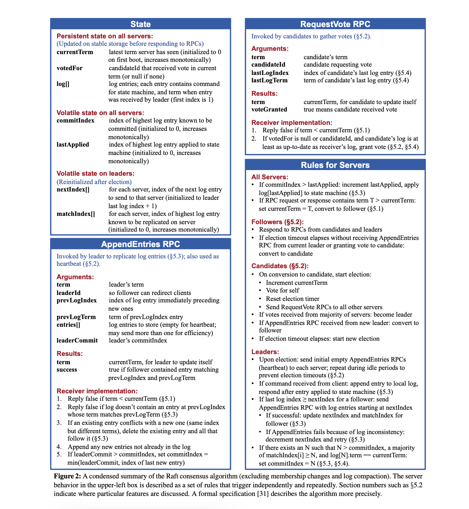

# StartupNews

This repository contains the code for a startup news blog app, with a raft consensus protocol backend built off gRPC.

### Features

- Creating and logging in to an account. We use a secure hashing algorithm to keep the password safe, and upon login, we allow the user to see how many unread messages they have. We do not allow for the same user to log in to multiple different devices.

- Our app is n-fault tolerant and persistent. As long as a majority of the servers are still working, it is able to handle the servers launching back up with the same data. It is n-fault tolerant since we allow the ability for new replicas to be added.

### Setup

To setup, we first require people to clone our repository via

```
git clone https://github.com/nchen55555/StartupNews.git
```

After, we require the user to have Python3 and pip installed on their system. To install the necessary packages, run

```
cd startup-news-backend
pip3 install -r requirements.txt
```

Now, we can finally use the app. Depending on the server and how you choose to run your system, you will need to double check your network setting to find the IP address of the server. Create our edit your `.env` file to include the IP address of the server. We've specified port 65432 as the default port, but feel free to change it to whatever you want.The server handles all client/user interactions, so we need to set the server up first. Run

```
cd startup-news
npm run dev
```

to activate the frontend. Run

```
cd startup-news-backend
python start_servers.py
```

to activate the servers.

### Architecture of the backend

#### Files

##### server.py

This contains the server code, which handles multiple client connections. This also accounts for multiple replicas, which we need to ensure our app is n-fault tolerant.

##### start_servers.py

This allows us to start multiple servers at once.

##### consensus.py

This creates the replica class and loads them up from a json file configuring our servers. Each replica is created with a different post and hort configuration, and they are used in our other files to make sure our servers can communicate with each other. We initialize each server node as a raft node.

##### test.py

This contains unit tests that we use to test the effectiveness of our app. Simply run these unit tests via

```
python test_{x}.py
```

where x represents what you want to test (functions, fault tolerance, or persistence).

##### util.py

This contains helper functions related to hashing.

##### requirements.txt

This contains the list of packages we need for the app.

##### blog.proto

This contains the structures and functions needed for our gRPC architecture. We use this file to autogenerate python files for server/client communication.

#### Consensus Protocol

We used the Raft Consensus Protocol. The exact algorithm of the protocol is underlined in the picture below. All functions for Raft were implemented under the gRPC backend.


#### Persistent Storage

#### Protocol
